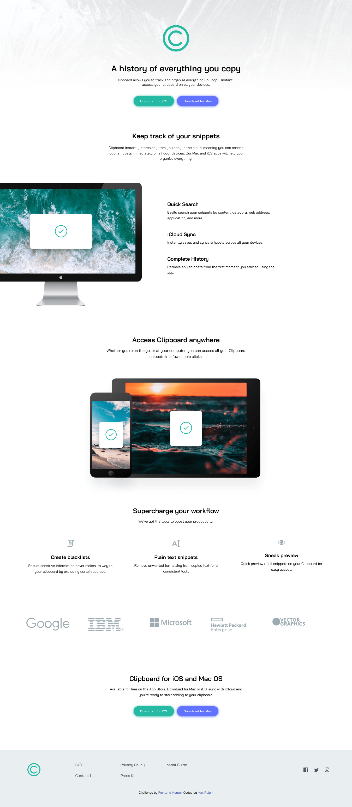

# Frontend Mentor - Clipboard landing page solution

This is a solution to the [Clipboard landing page challenge on Frontend Mentor](https://www.frontendmentor.io/challenges/clipboard-landing-page-5cc9bccd6c4c91111378ecb9).

## Table of contents

- [Overview](#overview)
  - [The challenge](#the-challenge)
  - [Screenshot](#screenshot)
  - [Links](#links)
  - [Built with](#built-with)
- [Author](#author)

**Note: Delete this note and update the table of contents based on what sections you keep.**

## Overview

### The challenge

Users should be able to:

- View the optimal layout for the site depending on their device's screen size
- See hover states for all interactive elements on the page

### Screenshot

### Links

- Solution URL: [codepen.io](https://codepen.io/maxralph/pen/BaxavjM)
- Live Site URL: [codepen.io](https://codepen.io/maxralph/full/BaxavjM)

### Built with

- Semantic HTML5 markup
- CSS custom properties
- SCSS
- Flexbox
- CSS Grid
- Mobile-first workflow

## Author

- Website - [Max Ralph](https://www.max-ralph.com)
- Frontend Mentor - [@maxralph002](https://www.frontendmentor.io/profile/maxralph002)
- Twitter - [@jsuis_maxralph](https://www.twitter.com/jsuis_maxralph)
